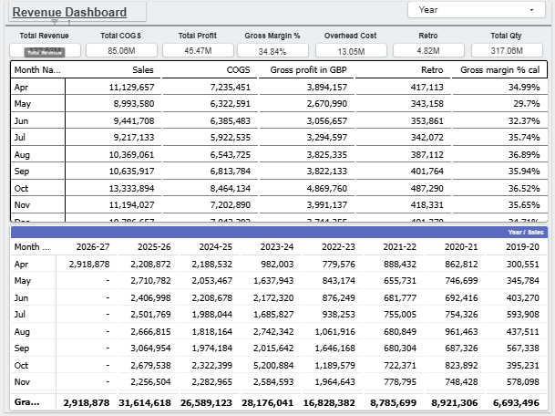
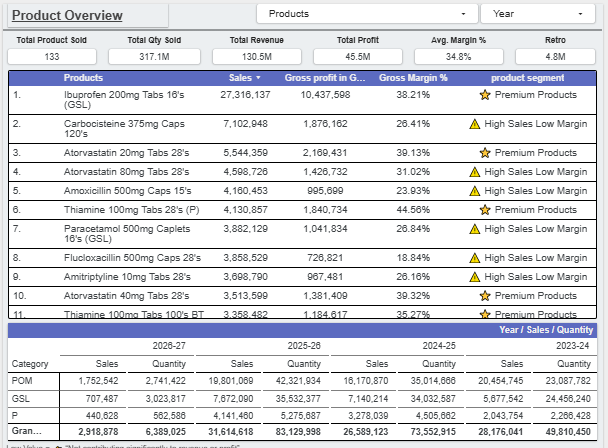
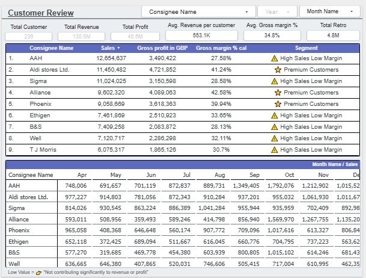
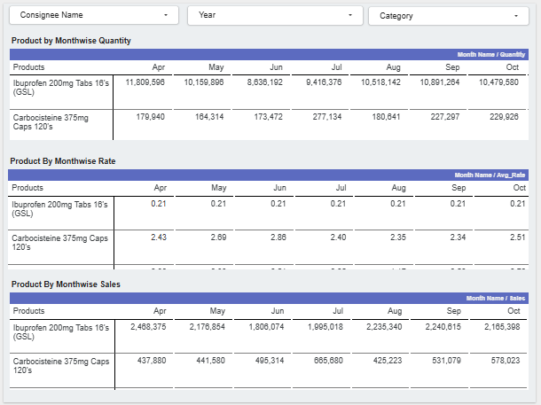

# FPL-UK-Sales-Dashboard
An interactive sales analytics dashboard developed in **Looker Studio** to analyze UK pharmaceutical sales performance. The dashboard enables business stakeholders to monitor revenue, profitability, customer purchasing patterns, product performance, and pricing effectiveness using regularly updated sales data.

> **Note:** As per the reporting requirements of the business, the dashboard is intentionally designed using **tabular visualizations instead of charts or graphs**, enabling detailed transactional analysis and easier operational reporting.

## Business Objective

- Analyze sales performance across products and customers.
- Monitor revenue, COGS, and Gross Margin.
- Identify top-performing products and customers.
- Evaluate pricing and quantity relationships.

## Dataset

The dashboard is built using historical UK pharmaceutical sales transaction data containing customer, product, category, quantity, pricing, revenue, COGS, and gross margin information.

## Tools Used

- Looker Studio
- Google Sheets

## Dashboard Pages

- Executive Sales Overview
- Product Performance
- Customer Performance
- Price vs Quantity Analysis

## KPIs

- Total Revenue
- Total COGS
- Total Profit
- Gross Margin %
- Total Quantity
- Top Products
- Top Customers
- Total Customers
- Average Selling Price

## Live Dashboard
👉 **[View Interactive Dashboard](https://datastudio.google.com/s/mLWa5J2ZufA)**

## Dashboard Preview

### Executive Sales Overview

### Product Performance

### Customer Performance

### Price vs Quantity Analysis

